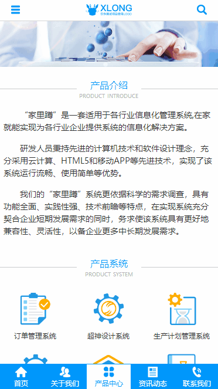

# xlong-test-vue

# 项目说明

该项目为单页应用测试项目，请勿商用。

项目用到技术与插件：Vue2.0、Axios、Sass、Vue-Awesome-Swiper。

## 部分项目运行截图
* 首页界面

* 关于我们\新闻资讯

* 产品中心\联系我们

* 侧边栏\搜索

## 安装项目依赖包
$ npm install

## 启动项目 端口:1029
$ npm run dev

## 项目打包
$ npm run build

## 项目目录
api ----- api目录，专门用来封装api数据请求接口

assets ----- 前端静态资源目录，包括公用css、特殊css、images静态图片、pic大图、js文件、jQuery插件等

components ----- 专门存放项目中的vue组件，包括公用组件、各页面的功能组件

router ----- 路由目录，专门用来存放页面跳转路由文件

pages ----- 项目的页面目录，专门用来存放各页面

* 组件：

Loading.vue ----- 加载动画

NavBar.vue ----- 顶部导航栏

TabBar.vue ----- 底部标签栏

SideBar.vue ----- 侧边栏

Swiper.vue ----- 轮播图

SectionTitle.vue ----- 章节标题

ProductList.vue ----- 产品列表

NewsList.vue ----- 资讯列表

CaseList.vue ----- 案例列表

SolutionList.vue ----- 解决方案列表

BMap.vue ----- 百度地图

Copyright.vue ----- 项目版权

* 路由页面

Home.vue ----- 首页

About.vue ----- 关于我们

News.vue ----- 新闻资讯

NewsDetails.vue ----- 新闻详情页

Product.vue ----- 产品中心

ProductDetails.vue ----- 产品详情页

Contact.vue ----- 联系我们

Solution.vue ----- 解决方案

Search.vue ----- 搜索

SearchResult.vue ----- 搜索结果

Intro.vue ----- 应用介绍

* API数据来源

豆瓣-电影API：
https://developers.douban.com/wiki/?title=movie_v2

* 作者联系方式

QQ：381612175

github：https://github.com/xLong1029/

站酷主页：http://xlong.zcool.com.cn/

UI中国：http://i.ui.cn/ucenter/358591.html

* 此项目做学习Vuejs测试使用，有什么问题可联系我讨论
